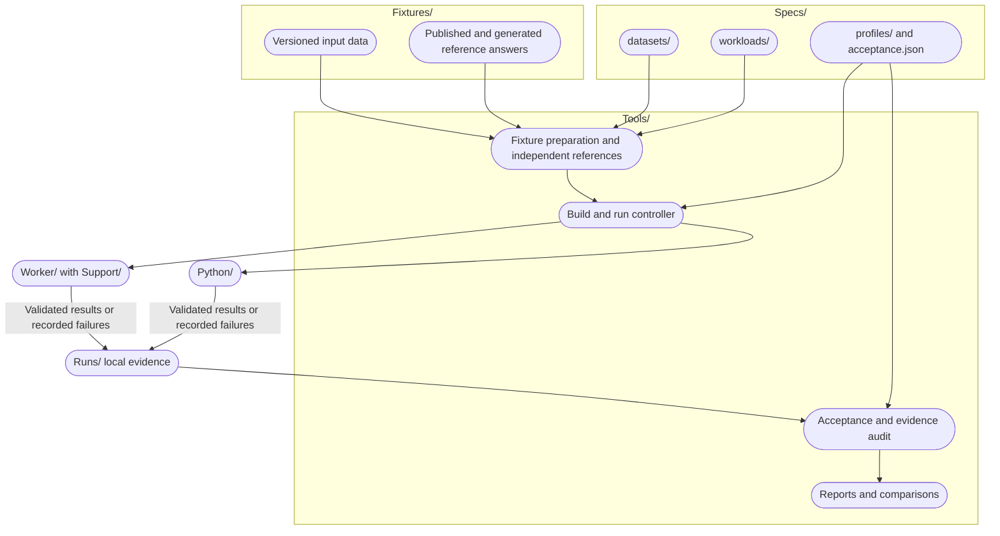

# Testing, validation, and benchmarks

This suite checks SwiftSci results against independent answers and measures completed work under declared conditions. It separates library tests, tests of the benchmark machinery, numerical conformance, and performance comparisons. Benchmark code is development tooling and is not part of a public library product.

The [structure map](#suite-structure) connects the execution flow to its owning folders. The [component definitions](#component-definitions) describe those responsibilities. [Run locally](#run-locally) contains the commands, and [complete suite acceptance](#complete-suite-acceptance) describes execution tiers and failure handling.

## Suite structure

The boxes group components by their location under `Benchmarks/`. Arrows show the flow of inputs and results, not directory nesting. Rounded nodes link to definitions below. Some Markdown viewers disable [Mermaid click links](https://mermaid.js.org/syntax/flowchart.html#interaction), so the same destinations appear beneath the diagram.



Diagram destinations: [fixtures and answers](#fixtures-and-reference-answers), [specifications](#experiment-specifications), [preparation](#preparation-and-reference-evaluation), [controller](#build-and-run-controller), [workers](#workers-and-output-validation), [evidence](#run-evidence), and [acceptance and reports](#acceptance-and-reporting).

Output validation happens inside each worker. It has no separate pipeline folder. The Swift worker uses [Support/Protocol.swift](Support/Protocol.swift), and Python adapters validate their outputs before returning responses. Several orchestration steps share `Tools/`. Generated inputs and run evidence belong to local working directories rather than committed fixture sources.

## Component definitions

### Fixtures and reference answers

[Fixtures/](Fixtures/) owns bundled source data, provenance, licenses, generators, and frozen reference artifacts. Published answers, analytic calculations, and independent high-precision implementations provide the expected values. Agreement between SwiftSci and pandas alone does not establish correctness.

| Fixture family | Purpose and definition |
| --- | --- |
| Deterministic tables | Fixed formulas and checksums for repeatable sizes. [Dataset manifests](Specs/datasets/) identify inputs, and [datasets.py](Tools/datasets.py) generates tables. |
| NIST univariate | Published mean and standard deviation, with variance derived from standard deviation. [NIST fixture contract](Fixtures/nist/README.md). |
| NIST regression and ANOVA | Separate original-decimal conformance from accuracy on binary64 inputs. [Numerical fixture contracts](Fixtures/nist-models/README.md). |
| Public data | H2O-derived grouping distributions and UCI wine preprocessing. [Public dataset provenance](Fixtures/public-data.md). |
| Supervised data | Frozen, duplicate-safe splits, train-only preprocessing, and complete held-out outputs for wine and WDBC. [Supervised dataset guide](Fixtures/supervised/README.md). |
| Exact and controlled models | Declared PCA, classification, inference, clustering, filtering, search, and explanation calculations. [Exact models](Fixtures/exact-models/README.md) and [controlled models](Fixtures/controlled-models/README.md). |
| Neural inference | Fixed weights, complete logits, cache behavior, and public parameter loading on explicit CPU and GPU paths. [Fixed decoder contract](Fixtures/neural/README.md). |
| Vision preprocessing | Normalized image layout, grayscale expansion, analytic constant resize, and padding. [Vision fixture contract](Fixtures/vision/README.md). |
| Dataframe-to-tensor integration | Row alignment, feature order, precision, mutation isolation, and bounded stage and size sweeps. [Boundary fixture contract](Fixtures/boundary/README.md). |
| Public scientific and model workflows | Typed CSV, filter/join/matrix/OLS integration, training-only preprocessing, and fresh-process native/Core ML persistence diagnostics. [Workflow contracts and limits](Fixtures/workflows/README.md). |

Model conformance checks declared calculations. It does not establish trained-model quality, clinical utility, or accuracy on unseen application data.

### Experiment specifications

[Specs/](Specs/) holds the records that define each experiment. A case pairs one dataset with one workload. A profile selects cases and their execution settings.

| Location | Responsibility |
| --- | --- |
| [datasets/](Specs/datasets/) | Input identity, provenance, generator version, byte count, checksum, and reference links. |
| [workloads/](Specs/workloads/) | Operation semantics, timing boundary, output representation, and numerical tolerances. |
| [profiles/](Specs/profiles/) | Cases, warmups, measured samples, independent process batches, and timeouts. |
| [schemas/](Specs/schemas/) | JSON schemas for serialized specifications and worker records. Runtime checks also live in the controller and worker implementations. |
| [acceptance.json](Specs/acceptance.json) | Canonical profile coverage, CPU, Apple, and sweep tiers, plus explicitly deferred work. |
| [legacy-inventory.json](Specs/legacy-inventory.json) | Mappings from historical workloads to standardized replacements or research dispositions. |

[contracts.py](Tools/contracts.py) validates specifications and computes experiment identities. The resolved plan records dataset and workload definitions with the source and engine identities. A changed operation or measurement boundary requires a new workload contract.

### Preparation and reference evaluation

[Tools/datasets.py](Tools/datasets.py) verifies or generates inputs and dispatches independent reference evaluation. Specialized fixture and reference modules also live in [Tools/](Tools/). Fixture-specific regeneration scripts remain beside their data in `Fixtures/`.

[Data/standardized/](#local-artifacts) holds prepared inputs locally. Preparation verifies their checksums. Corrupt cached data causes a failure rather than silent replacement. Expected output bytes are produced outside the measured operation and retained with the run.

### Build and run controller

[Tools/bench.py](Tools/bench.py) exposes `prepare`, `build`, `run`, `certify`, `audit`, `report`, `compare`, and `inventory`. [Tools/runner.py](Tools/runner.py) owns build snapshots, resolved plans, worker processes, repetitions, and incremental result records.

The builder copies tracked files into a separate directory and builds a Release executable. It verifies source and binary fingerprints and rejects coverage-instrumented executables. The `build-for-testing` action compiles targets without executing the library test suite.

The runner starts a fresh process for each case, engine, and batch. Each process performs its configured warmups and measured samples. Builds and runs use a checkout-level lock. Other applications can still compete for CPU, GPU, and memory resources.

### Workers and output validation

[Worker/](Worker/) contains Swift adapters that call SwiftSci APIs. [Support/](Support/) defines the Swift request, sample, and response protocol, verifies input bytes, and checks complete numerical outputs.

[Python/standard_worker.py](Python/standard_worker.py) dispatches the comparison implementations in [Python/](Python/). The engine name `pandas` includes NumPy, SciPy, PyArrow, and other declared implementations where the operation requires them. It does not mean every calculation uses pandas.

Both workers validate every output element against independent expected values. Shape, row order, target alignment, and device requirements form part of the relevant contracts. Each numerical workload declares its absolute and relative tolerances. Parquet output receives an additional independent readback check.

Workers keep outputs alive through the end timestamp. Reference evaluation and answer comparison happen outside timing. GPU workloads explicitly select the device and complete the required evaluation and synchronization. The NumPy comparator runs on CPU, so those comparisons do not establish matched GPU performance.

### Run evidence

Each local run directory contains the following records:

| Artifact | Contents |
| --- | --- |
| `run.json` | Resolved plan, source and binary identities, environment, events, samples, and summaries. |
| `events.jsonl` | Incremental records of completed worker attempts. |
| `*.request.json` and `*.response.json` | Exact worker requests and responses, including sample metadata or failures. |
| `*.expected.f64` | Expected numerical output bytes used for validation. |
| `*.log` | Worker diagnostics and failure details. |
| `certificate.json` | Run checksum, contract identity, source identity, case identities, validated sample count, and status. |
| `acceptance.json` | Cross-profile coverage and outcomes, written in the parent directory of an acceptance run. |

A run directory is never overwritten. Incomplete evidence, crashes, timeouts, and wrong answers cannot produce a passing certificate. A certificate is an unsigned local conformance record for its declared workloads. It does not imply NIST endorsement or third-party accreditation.

### Acceptance and reporting

[Tools/acceptance.py](Tools/acceptance.py) prepares and executes every profile selected by [the acceptance policy](Specs/acceptance.json). It continues after failed profiles and distinguishes recorded worker failures from missing evidence or infrastructure failures. Source and specification identities must remain unchanged throughout acceptance.

[Tools/reporting.py](Tools/reporting.py) audits recorded runs, summarizes samples, and compares compatible experiments. The report uses a median within each process, followed by a median of those process medians. It preserves every sample and does not trim outliers. Unresolved timings cannot support a speedup ratio.

[Tools/sweeps.py](Tools/sweeps.py) reports the bounded conversion, prepared-computation, and full-pipeline sweeps. Whole-process peak resident memory, logical source bytes, and logical tensor bytes are separate measurements. None is an operation-specific allocation count.

Comparison requires compatible experiment contracts, environments, reference-engine versions, and case coverage. A passing correctness check is required before a measurement can support a performance comparison. Diagnostic timings do not establish a formal performance baseline.

## Tests and continuous integration

| Location | What it verifies |
| --- | --- |
| [Repository Tests/](../Tests/) | Library APIs and regressions, organized by SwiftSci module. |
| [Benchmarks/Tests/](Tests/) | Fixture generation, independent references, contracts, workers, reporting, timeouts, rejection checks, and altered evidence. |
| [SwiftSciBenchmarkSupportTests](../Tests/SwiftSciBenchmarkSupportTests/) | Swift protocol validation and malformed input or output rejection. |
| [Ordinary CI](../.github/workflows/ci.yml) | A selected library test set. The workflow explicitly skips several MLX-dependent suites. |
| [Benchmark conformance CI](../.github/workflows/benchmark-conformance.yml) | Benchmark controller tests, legacy coverage reconciliation, and the complete CPU acceptance tier. Evidence is retained even when a run fails. |

Explicit Metal diagnostics and larger sweeps run on an identified Apple silicon host through the same acceptance command. The CPU tier still uses the macOS Swift build. It is not a promise of cross-platform support. Shared-runner timings do not gate performance.

## Local artifacts

`Benchmarks/Data/standardized/` contains prepared inputs. `Benchmarks/Runs/` contains local run evidence. Both are generated working data, so their definitions are linked here instead of linking to run directories that may not exist in a clean checkout.

Build snapshots, build records, logs, and products live under `~/Library/Caches/SwiftSci/standardized-benchmarks/` by default. They are outside the repository checkout.

## Historical and research work

[Results/](Results/) preserves historical measurements. [Specs/legacy-inventory.json](Specs/legacy-inventory.json) records which historical workloads have standardized replacements and which remain research. The research implementations in [Swift/](Swift/), [CSVAcceleration/](CSVAcceleration/), and legacy [Python/](Python/) scripts have different measurement contracts.

Kiraa is an unofficial research reference with known bugs. It is neither an independent correctness oracle nor a supported standardized engine. Trained-model quality, unmatched algorithms, long-context inference, and physical zero-copy claims remain outside the current conformance scope.

## Run locally

Use an Apple silicon Mac with Xcode selected and Python 3.12 or newer. Run these commands from the repository root. The initial dependency installation and Swift package resolution require network access; prepared datasets require none.

```bash
python3 -m venv Benchmarks/.venv-standardized
Benchmarks/.venv-standardized/bin/python -m pip install -r Benchmarks/Python/requirements-standardized.txt
Benchmarks/.venv-standardized/bin/python -m unittest discover -s Benchmarks/Tests
Benchmarks/.venv-standardized/bin/python Benchmarks/Tools/bench.py prepare --profile smoke
Benchmarks/.venv-standardized/bin/python Benchmarks/Tools/bench.py build
```

The build command prints the worker path. By default it is:

```bash
worker="$HOME/Library/Caches/SwiftSci/standardized-benchmarks/derived/Build/Products/Release/SwiftSciBenchmarkWorker"
Benchmarks/.venv-standardized/bin/python Benchmarks/Tools/bench.py run --profile smoke \
  --engines swiftsci,pandas --swift-worker "$worker" \
  --python Benchmarks/.venv-standardized/bin/python \
  --output Benchmarks/Runs/smoke-01
Benchmarks/.venv-standardized/bin/python Benchmarks/Tools/bench.py audit Benchmarks/Runs/smoke-01
Benchmarks/.venv-standardized/bin/python Benchmarks/Tools/bench.py report Benchmarks/Runs/smoke-01
```

Choose a new output directory for every run. Existing evidence is never overwritten. Rebuild after changing sources or after another Xcode command replaces the worker in the same derived-data directory. A binary checksum mismatch requires a rebuild; do not edit the build record. The builder copies Git-tracked files, including staged additions and their working contents, into a separate cache directory. Stage new source files before building. This excludes untracked cloud-sync duplicate files without changing the checkout. Xcode uses the package-level Release `build-for-testing` action with `-enableCodeCoverage NO` and dependencies pinned in `Package.resolved`. This compiles the targets without running the test suite. The generated Swift package scheme can ignore coverage settings during a plain `build` action. The builder and run planner inspect the actual Mach-O binary and reject LLVM profiling or coverage sections. A compiler setting alone is not proof that instrumentation is absent. It permits package plugins for this invocation only.

## Optional comparison engines

Polars and DuckDB use the same dataset, workload, materialized-output, and evidence contracts as the Swift and Python workers. Install [requirements-comparison.txt](Python/requirements-comparison.txt) to enable them. The standard environment remains sufficient for Swift/Python qualification.

[Compare SwiftSci with Polars and DuckDB](COMPARISON-ENGINES.md) describes setup, the complete comparison command, supported overlap, and measurement limits. Use `--engines swiftsci,pandas,polars,duckdb` with compatible profiles. Unsupported operations fail during planning; the runner does not silently drop them.

The `tabular-smoke` and `tabular-migration` profiles select the 19 supported migration cases. The full `migration` profile retains all 36 cases for Swift/Python. Benchmark conformance CI installs the comparison dependencies and validates both new workers against tabular, public-data, and NIST smoke cases. Larger performance comparisons remain local runs.

## Profiles and supported operations

| Profile | Table rows | Warmups / measured samples per process | Independent processes per case and engine |
| --- | ---: | ---: | ---: |
| `smoke` | 129 | 0 / 1 | 1 |
| `standard` | 100,000 | 2 / 5 | 3 |
| `extended` | 1,000,000 | 2 / 5 | 3 |
| `certification` | All nine NIST univariate datasets | 0 / 1 | 1 |
| `nist` | All nine NIST univariate datasets | 2 / 5 | 3 |
| `migration-smoke` | Small numeric, mixed and Parquet fixtures | 0 / 1 | 1 |
| `migration` | Mixed sizes declared per case | 2 / 5 | 3 |
| `public-smoke` | 257 synthetic rows; 1,599 real wine rows | 0 / 1 | 1 |
| `public-data` | 100,000 synthetic rows; 1,599 real wine rows | 2 / 5 | 3 |
| `numerical-conformance` | Eight NIST OLS and eleven ANOVA datasets | 0 / 1 | 1 |
| `numerical-binary64` | Same 19 inputs with exact-binary64 references | 0 / 1 | 1 |
| `model-conformance` | Two PCA and one multinomial Naive Bayes fixture | 0 / 1 | 1 |
| `controlled-conformance` | Ten fixed inference, clustering, Kalman, search and explanation fixtures | 1 / 2 | 1 |

The first three profiles each contain 11 table workloads and three NIST checks. All four adapters support CSV read, numeric filtering, stable sorting, grouped sum, matrix export, target-vector export, standard scaling, min-max scaling, mean, sample variance and sample standard deviation. The `pandas` adapter uses pandas for dataframe work and NumPy for numerical work.

The table generator has fixed integer formulas, exact quarter fractions, fixed column order and line endings. Each size has a committed SHA-256 and byte count. `prepare` fails if an existing cached file is corrupt. It never silently replaces bad data. The nine unchanged NIST univariate fixtures cover varied scales and numerical difficulty. Mean and standard deviation use published answers; variance references are derived from those standard deviations. See [NIST coverage and tolerances](Fixtures/nist/README.md).

The original table profiles cover finite numeric data and one grouping key. The certification and NIST profiles each contain 27 numerical cases, using dataset-specific tolerances recorded in the resolved plan. `extended` increases size; it does not yet add nulls, text, skewed distributions, H2O or Kiraa. Unsupported engine names fail explicitly. Historical Kiraa comparisons remain under `Results/DataFrameOptimization`. The Kiraa development build used here is unofficial and has known bugs. It remains an optional experimental reference, never an accuracy oracle or production baseline. It is not a supported standardized engine.

The migration profiles add streaming CSV, mixed numeric/string/Boolean types, joins, Parquet, multi-output grouping, row reductions, correlations, hypothesis tests, regression metrics, ROC-AUC, encoders, SQLite ingestion, RAG summaries and pooling/Dice workloads. Each profile declares 36 cases. Read its resolved plan for the exact input size and operation boundary. The `pandas` adapter also uses SciPy, PyArrow and SQLite where the workload requires them. Parquet interoperability regression tests also cover nulls; the timed migration fixtures do not. These profiles complement the original profiles; they do not replace the NIST checks.

```bash
Benchmarks/.venv-standardized/bin/python Benchmarks/Tools/bench.py inventory
Benchmarks/.venv-standardized/bin/python Benchmarks/Tools/bench.py prepare --profile migration-smoke
Benchmarks/.venv-standardized/bin/python Benchmarks/Tools/bench.py run --profile migration-smoke \
  --engines swiftsci,pandas --swift-worker "$worker" \
  --python Benchmarks/.venv-standardized/bin/python \
  --output Benchmarks/Runs/migration-smoke-01
Benchmarks/.venv-standardized/bin/python Benchmarks/Tools/bench.py audit Benchmarks/Runs/migration-smoke-01
```

`inventory` reconciles 133 legacy result rows and two diagnostics with standardized workloads or explicit research dispositions. A row marked as migrated identifies its replacement contract; it does not certify historical output. Learned-model and GPU workloads that remain research require `--research` and cannot support certification or production claims.

To run the larger profile, prepare it first and change `--profile` and the output directory. Close competing CPU/GPU workloads and keep power conditions consistent before taking performance measurements. The controller serializes its own builds and runs within this checkout; it cannot prevent other applications or checkouts from consuming resources.

The numerical profiles extend coverage to CPU model fitting and balanced ANOVA. They distinguish original decimal conformance from arithmetic accuracy on binary64 inputs. Difficult cases remain in the profiles even when they fail. Read the [numerical fixture contracts](Fixtures/nist-models/README.md) before interpreting results. These profiles are diagnostic, not performance baselines or a claim of library-wide certification.

The `model-conformance` profile checks exact synthetic PCA and Naive Bayes contracts. Its [fixture documentation](Fixtures/exact-models/README.md) explains sign-invariant comparisons, total-variance ratios and the distinction between class labels and prediction indices. It provides no model-quality claim.

The `controlled-conformance` profile exercises supplied-weight inference, one-cluster KMeans, scalar and two-state Kalman filtering, cosine search and exact two-feature explanations. Read its [contracts and limits](Fixtures/controlled-models/README.md). All ten cases retain strict answers even when an implementation fails. Repeated samples validate state reset. These diagnostic timings do not establish a formal performance baseline.

## What is measured

Each workload specification declares its timing boundary. CSV measures verified, warm-cache file parsing into a materialized frame. Filter, sort and group operations start with a prepared frame. Matrix/vector export includes conversion. Scaling includes fitting, transformation and exporting the result. Numerical reductions start with a prepared vector. Input preparation, reference evaluation and output validation are outside the timer. Synchronous operations use a synchronous dispatcher; CSV, Parquet and SQLite operations await their asynchronous APIs. Measurement contract v5 requires an uninstrumented worker and includes streaming chunk checks and independent Parquet validation. It cannot be compared with earlier measurement contracts.

Both workers retain the result through the end timestamp, then validate every output element. Sorting must preserve input order for ties. Group results are converted to numeric keys and ordered outside timing so that different native result representations can be compared. Exact workloads require exact numeric values; numerical workloads declare absolute and relative tolerances in `Specs/workloads`.

`peak_rss_bytes` is the whole worker process lifetime high-water mark, including imports, setup and validation. It is not operation allocation or logical dataframe storage. BLAS/OpenMP thread environment variables are set to one; this does not limit Swift task concurrency or every library's internal threads.

The reporter takes the median within each process, then the median of those process medians. It retains all samples, reports the worst measured absolute output error, and does not trim outliers. Each worker explicitly marks durations below one microsecond as unresolved, including zero when the timer cannot distinguish its start and end. Those samples still undergo complete output validation. The reporter preserves their raw durations and suppresses a speedup ratio if either case contains any unresolved sample. This conservative threshold is not a measured clock-resolution guarantee. Smoke, migration-smoke, public-smoke and certification timings are informational.

## Certification and comparisons

```bash
Benchmarks/.venv-standardized/bin/python Benchmarks/Tools/bench.py prepare --profile certification
Benchmarks/.venv-standardized/bin/python Benchmarks/Tools/bench.py certify --engines swiftsci,pandas \
  --swift-worker "$worker" --python Benchmarks/.venv-standardized/bin/python \
  --output Benchmarks/Runs/certification-01
Benchmarks/.venv-standardized/bin/python Benchmarks/Tools/bench.py audit Benchmarks/Runs/certification-01
Benchmarks/.venv-standardized/bin/python Benchmarks/Tools/bench.py run --profile nist --engines swiftsci,pandas \
  --swift-worker "$worker" --python Benchmarks/.venv-standardized/bin/python \
  --output Benchmarks/Runs/nist-01
Benchmarks/.venv-standardized/bin/python Benchmarks/Tools/bench.py audit Benchmarks/Runs/nist-01
Benchmarks/.venv-standardized/bin/python Benchmarks/Tools/bench.py compare Benchmarks/Runs/baseline Benchmarks/Runs/candidate
```

A certificate is a local workload-conformance record. It binds the run checksum, experiment contract, source fingerprint, case identities and validated sample count. It is unsigned and does not imply NIST endorsement, third-party accreditation, or correctness of untested APIs. `audit` checks the checksum, complete case coverage, sample counts and validation status. Crashes, timeouts, missing responses and output mismatches fail the run and cannot yield a passing certificate.

`compare` takes existing run directories, not Git revisions. Build and run each revision with the same benchmark tooling and profile on the same machine. Comparisons reject different experiment contracts, environments, reference engine versions or case coverage. Inspect the recorded dependency locks and build commands before attributing a difference solely to library code. The command reports each engine's before/after ratio; it does not claim statistical significance or apply a performance gate.

`run.json` retains the resolved plan, source-file hashes, binary identity, build flags, dependency-lock hash, environment, raw samples and summaries. Per-process requests, responses and logs remain beside it. `events.jsonl` and incremental run records preserve completed work if interrupted; an interrupted run cannot pass an audit.

## CI and development

The [Benchmark conformance workflow](../.github/workflows/benchmark-conformance.yml) runs controller tests, reconciles legacy coverage, and executes every profile in the CPU acceptance tier. It retains evidence for 30 days, including failed runs. Known numerical failures keep the job failed. Shared-runner timings do not gate a PR. The normal package test suite includes `SwiftSciBenchmarkSupportTests`, which rejects invalid output, corrupt data, and malformed binary fixtures.

Add a workload by defining its semantics and tolerance, adding an independent reference and both worker implementations, then including it in a profile. Change the workload version when semantics change. Add generator versions and checksum manifests for new datasets. A faster result is usable only after its output passes validation.

The legacy `SwiftSciBenchmarks`, `Python/benchmarks.py` and `Python/accuracy_benchmarks.py` require `--research`. They label console and JSON output as unvalidated research. Their input and measurement rules differ from the standardized contracts. `Python/compare.py` is retired and always fails with directions to the standardized comparison command. Preserve historical artifacts; use audited standardized runs for new comparisons.

## Public workload profiles

`public-smoke` and `public-data` each contain 11 cases. Ten run the first five H2O-derived grouping queries on two key distributions. The last runs a full preprocessing workflow on all 1,599 rows of the pinned UCI red-wine dataset. Existing NIST profiles retain the 27 univariate checks. These additions do not extend NIST certification to other numerical APIs.

Prepare and run either profile with the same commands used above, replacing the profile name and output directory. Both profiles run offline after dependency installation; the small UCI source is bundled. Preparation verifies its original bytes and the derived CSV separately. No adapter downloads data during a run.

The H2O cases use an independent deterministic generator and smaller sizes. They are not an official H2O benchmark reproduction. See [public dataset provenance and workload boundaries](Fixtures/public-data.md) for query definitions, distributions and limitations. The wine case includes CSV reading, filtering, stable sorting, fitting population scaling and exporting the feature matrix, target vector and source-row IDs. Every measured result is checked against a separate Decimal reference, including target alignment. This measures descriptive preprocessing, not model training or predictive quality.

The `supervised-conformance` profile adds frozen, duplicate-safe train/validation/test splits for licensed public data. It checks train-only scaling and complete held-out regression outputs against independent high-precision references. See the [supervised dataset guide](Fixtures/supervised/README.md) for provenance, limitations and regeneration. Predictive quality and a formal performance baseline remain separate claims.

## Dataframe semantic conformance

The `dataframe-conformance` profile contains 24 bounded cases for exact integer handling, null versus NaN, stable sorting, grouping, functional replacement and logical matrix exports. Read the [input and result contract](Fixtures/dataframe/README.md) before interpreting the pandas comparison. It uses explicit compatibility conversions and reports diagnostic timings only. Prepare and run it with the same commands as the other profiles, substituting `dataframe-conformance` as the profile name.

## Fixed neural inference

The `neural-conformance` profile checks fixed Float32 decoder logits on explicitly selected MLX CPU and GPU paths. `neural-cpu-conformance` contains its CPU subset. The separate `neural-loader-conformance` profile checks complete parameter replacement through the public loader and retains failures. See the [fixed decoder contract](Fixtures/neural/README.md) for independent references, cache rules, device requirements and limits. The NumPy comparator runs on CPU; these diagnostic timings do not support matched-backend speed claims.

## Complete suite acceptance

`Specs/acceptance.json` assigns every canonical profile to an execution tier and names deferred coverage. `cpu` runs bounded CPU conformance, including numerical, model and supervised cases. `apple` also runs explicit Metal and loader diagnostics. `sweep` runs repeated size profiles and the bounded conversion/computation sweeps. `all` runs every profile. The inventory command separately preserves the disposition of every legacy registration; a replacement contract does not validate historical timing results.

```sh
Benchmarks/.venv-standardized/bin/python Benchmarks/Tools/acceptance.py \
  --tier all \
  --swift-worker "$HOME/Library/Caches/SwiftSci/standardized-benchmarks/derived/Build/Products/Release/SwiftSciBenchmarkWorker" \
  --python Benchmarks/.venv-standardized/bin/python \
  --output Benchmarks/Runs/acceptance-unique-name
```

Build the worker first with `bench.py build`. Use a new output directory for each acceptance run. The command prepares and executes each profile even after another profile fails. It returns nonzero if any profile fails. The report distinguishes complete recorded worker failures from missing evidence, crashes and setup failures. It never converts a known failure into a passing certificate. The source identity, tracked fixture/specification identity, full worker requests, independently reconstructed expected bytes, responses and certificate hashes are checked throughout the run. Keep the checkout unchanged during acceptance.

The GitHub workflow runs the CPU tier and uploads its full output even on failure. Explicit Metal and larger sweeps run locally on an identified Apple silicon host through the same command. Hosted GPU execution and automatic access to a private Mac are not assumed. Existing numerical or loader failures can keep the workflow red until the separate production repair work passes those contracts.

[Vision fixtures](Fixtures/vision/README.md) cover normalized image layout, grayscale expansion, analytic constant resize and padding. [Boundary fixtures](Fixtures/boundary/README.md) cover frame-to-tensor row alignment, dtype, complete affine arithmetic and mutation isolation. They also define 54 bounded size/stage cases and the sweep report command. Existing public-data cases cover CSV-to-feature/target workflows, and migration profiles retain independent Parquet validation.

This completes the declared testing infrastructure scope, not certification of every library API. Arbitrary image interpolation, trained checkpoints and quality targets, unmatched training algorithms, long-context inference and physical zero-copy claims remain explicit research or future contracts. Passing records are workload conformance evidence, not NIST endorsement or third-party accreditation. Establish a formal performance baseline only after production repairs pass the relevant complete suite.

## Public workflow conformance

The `scientific-workflow` profile checks four complete CSV-to-numerical-result cases with declared column types, duplicate join keys, and reordered inputs. The `persisted-workflow` profile checks training-only preprocessing and prediction, native regressor reload, and composite Core ML pipeline export in fresh processes. Read the [workflow contracts](Fixtures/workflows/README.md) for the distinction between fitted-state validation and persistence, diagnostic timing limits, and retained failure evidence. Both profiles run in the CPU acceptance tier. CI also challenges passing workers with corrupt answers and malformed inputs.

## Known failures and the CI regression policy

Conformance remains strict: failed engine cases retain failed responses, runs, and certificates. The default acceptance command exits nonzero for any conformance failure.

CPU CI also applies `Benchmarks/Specs/known-failures.json` with `acceptance.py --tier cpu --check-baseline`. This reviewed inventory binds each exception to its profile, case, engine, resolved contract hash, reference basis, classification, and exact observed worker error. CPU coverage, full profile settings, and contract identities are pinned. The loader verifies each reference basis against its dataset and each classification against its engine role. A failed response counts as numerical evidence only when the worker exits with the expected failure code; a crash or timeout remains an infrastructure error. New or changed failures, missing profiles or cases, infrastructure errors, and unexpected passes block the policy check. An unexpected pass requires removing or reviewing the stale entry. Tolerances are not changed.

The separate `regression-policy.json` reports the policy result and the strict conformance result. A passing regression policy is not a conformance certificate. `swiftsci` is the implementation under test; the `pandas` adapter is a comparison engine, not the correctness oracle. Independent fixture/reference definitions remain authoritative. Classification distinguishes implementation defects, input representation limits, and comparator accuracy failures.

Exact error signatures deliberately fail closed. A new platform or toolchain may produce a different diagnostic or numerical result for a known case. Investigate it and add evidence in a reviewed commit rather than introducing broad error patterns or automatic baseline updates. Remove entries in the same contribution that repairs them. Contract or coverage changes require reviewing the inventory and its coverage hash. The reviewed inventory currently applies only to the CPU tier; other tiers retain strict acceptance behavior.
