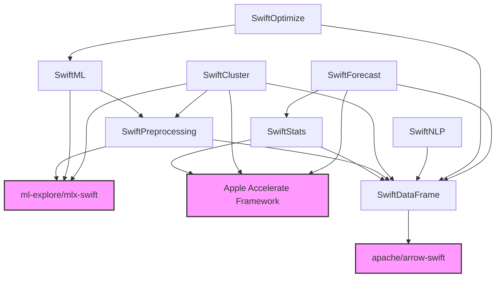
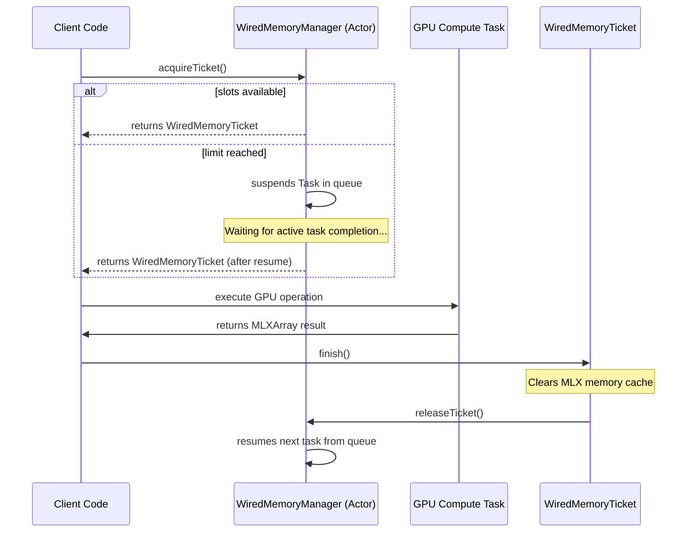

# Part II — Architecture

## Package Structure

SwiftAnalytics is structured as a single, multi-module Swift Package. Rather than compiling as a monolithic framework, it is partitioned into separate, logically isolated targets. This enforces encapsulation, simplifies unit testing, and manages compile-time dependency graphs.

The target directory layout is as follows:

```text
SwiftAnalytics/
├── Sources/
│   ├── SwiftDataFrame/         # Columnar manipulation & Arrow integration
│   ├── SwiftStats/             # Accelerate-backed statistical analysis
│   ├── SwiftPreprocessing/     # Scale, encode, and prepare MLX inputs
│   ├── SwiftML/                # MLX-backed & CPU-based ML models
│   ├── SwiftCluster/           # Unsupervised learning (PCA, KMeans, DBSCAN)
│   ├── SwiftNLP/               # Tokenizers and text embeddings
│   ├── SwiftOptimize/          # Metrics, cross-validation & hyperparameter tuning
│   └── SwiftForecast/          # Time series analysis (ARIMA, Kalman Filter)
└── Benchmarks/
    └── Swift/                  # Execution target for performance suites
```

---

## Module Dependencies

The dependencies between targets are strictly defined in [Package.swift](file:///Users/oleksiichumak/Developer/Xcode.projects/SwiftAnalytics/SwiftAnalytics/Package.swift). High-level modules build upon low-level foundation modules.

Below is the dependency graph showing the relationship between modules and external packages:



---

## Memory Model

### Unified Memory Architecture (UMA)
Apple Silicon chips feature a Unified Memory Architecture (UMA). The CPU, GPU, and Neural Engine share access to the same physical memory space. In traditional architectures (e.g., discrete Nvidia/AMD GPUs), data must be copied over a PCIe bus from CPU host memory to GPU device memory, adding massive serialization overhead.

In SwiftAnalytics, we design our memory structures to leverage UMA:
* **Zero-Copy Allocations**: Matrices and arrays share memory directly between CPU processing (e.g., Accelerate LAPACK) and GPU processing (e.g., MLX Metal shaders).
* **Arrow Memory Buffer**: The underlying data storage in `SwiftDataFrame` is managed by an internal Apache Arrow buffer (`DataBuffer`). This ensures that memory alignment matches hardware cache lines and permits instantaneous, copy-free reading of data tables.

---

## Hardware Routing

To maximize computational throughput while keeping memory utilization under control, SwiftAnalytics implements an automatic routing layer via [HardwareRouter](file:///Users/oleksiichumak/Developer/Xcode.projects/SwiftAnalytics/SwiftAnalytics/Sources/SwiftPreprocessing/Core/HardwareRouter.swift).

For algorithms that support both CPU and GPU backends (like `PCA`, `LinearRegression`, and `LogisticRegression`), the developer can specify an `ExecutionDevice` preference (`.cpu`, `.gpu`, or `.auto`). When set to `.auto`, the router evaluates runtime heuristics to dispatch the operation:

* **CPU Execution**: Best for small dataset payloads where GPU scheduling overhead (Metal pipeline setup, command queue dispatching) exceeds computational time, or for algorithms with high branch divergence (like `DBSCAN` or `DecisionTree`).
* **GPU Execution**: Best for larger datasets with matrix-heavy operations that can be vectorized over thousands of Metal execution units.

### Routing Heuristics

The `resolveDevice` function applies the following thresholds:

| Algorithm | CPU Threshold | GPU Threshold | Notes |
| :--- | :--- | :--- | :--- |
| **KMeans** | `< 4,000` data cells | `≥ 4,000` data cells | Evaluates `sampleCount * featureCount` |
| **PCA** | `< 2,000` samples AND `< 500` features | Otherwise | SVD is highly optimized in LAPACK on CPU |
| **Linear / Logistic Regression** | `< 1,000` samples | `≥ 1,000` samples | GPU handles massive matrix gradient steps |
| **DBSCAN** | Always CPU | Never GPU | High branch divergence (BFS region query) |

---

## Concurrency Model

SwiftAnalytics implements Swift 6 strict concurrency checks to guarantee compile-time data race safety.

### Mitigating Non-Sendable `MLXArray`
The `MLXArray` struct from the `mlx-swift` package is not `Sendable` because it represents a mutable reference to a tensor on the GPU. Passing `MLXArray` across concurrency boundaries (e.g., between different actors or tasks) is unsafe and would trigger compiler errors under Swift 6.

To resolve this, SwiftAnalytics wraps MLX computations inside `actor` instances or isolates them to specific task threads. Additionally, we enforce resource limits using a ticket-based reservation system:



### WiredMemoryManager & WiredMemoryTicket

* **[WiredMemoryManager](file:///Users/oleksiichumak/Developer/Xcode.projects/SwiftAnalytics/SwiftAnalytics/Sources/SwiftPreprocessing/Core/WiredMemoryManager.swift)**: An actor that maintains a FIFO suspension queue of `CheckedContinuation` objects. It limits concurrent GPU tasks (default limit of `2`) to prevent GPU memory saturation.
* **[WiredMemoryTicket](file:///Users/oleksiichumak/Developer/Xcode.projects/SwiftAnalytics/SwiftAnalytics/Sources/SwiftPreprocessing/Core/WiredMemoryTicket.swift)**: A `Sendable` helper object returned upon acquiring a slot. When finished, it clears the MLX GPU memory cache via `MLX.Memory.clearCache()` and frees the reservation slot in the manager.

---

## Error Handling & Logging

### Error Handling Philosophy
We do not use generic or silent failures. All operations that can fail (e.g., matrix inversion failures, dimension mismatches, empty inputs) throw strongly typed Swift errors.

Each module declares its own error enum conforming to `Error`:
* `DataFrameError`: Out-of-bounds column access, type casting failures.
* `ClusterError`: Dimension mismatches, invalid K-Means initializations, empty inputs.
* `MLXError`: Mathematical divergence, shape mismatch, uninitialized weights.

Example of a structured check in `PCA`:
```swift
guard nComponents <= min(numSamples, numFeatures) else {
    throw ClusterError.invalidParameter("nComponents (\(nComponents)) cannot be greater than min(samples: \(numSamples), features: \(numFeatures)).")
}
```

### Logging
Logging is designed to be lightweight and non-blocking. It uses Apple's native `os.Logger` subsystem, categorizing logs into `.debug`, `.info`, `.error`, and `.fault`. Computational loops never log to the console to prevent terminal output bottlenecks.

---

## Benchmark Infrastructure

To verify performance gains and regression safety, the package incorporates a dual-language benchmarking suite:

1. **[SwiftAnalyticsBenchmarks](file:///Users/oleksiichumak/Developer/Xcode.projects/SwiftAnalytics/Benchmarks/Swift)**: A native Swift executable executing real-world data pipelines (DataFrames, ML regressions, Forecast filters) with live console progress reporting.
2. **Python Baseline Suite**: An identical set of scripts using Pandas, NumPy, Scikit-Learn, and Statsmodels executing on the same host CPU/GPU.
3. **[compare.py](file:///Users/oleksiichumak/Developer/Xcode.projects/SwiftAnalytics/compare.py)**: An automation script comparing the execution times of both suites. It serves as a CI/CD performance gate, ensuring that PR updates do not degrade execution speeds.
