# 🗺️ Implementation Plan — SwiftSci 3.3.0: Core ML Pipelines, Database TLS & VectorStore

> **Target Version**: `v3.3.0`  
> **Release Target**: Q4 2026  
> **Platform Focus**: macOS 14+ (Apple Silicon M-Series), iOS 18+, Swift 6 Strict Concurrency  

---

## 📌 Milestone Overview & Objective

**SwiftSci 3.3.0** focuses on completing on-device MLOps pipeline export, enterprise database encryption, and foundational vector similarity search for Apple Silicon.

```mermaid
flowchart TD
    subgraph 1. MLOps Core ML Pipeline
        A[StandardScaler / Encoders] --> B[Pipeline Chaining]
        C[Estimators: RF / MLP] --> B
        B --> D[CoreMLExporter: Pipeline Message]
        D --> E[.mlpackage Directory Bundle]
        E --> F[FP16 ANE Quantization]
    end

    subgraph 2. Enterprise Database Security
        G[PostgreSQL / MySQL Client] --> H[Apple Network.framework NWConnection]
        H --> I[Native TLS/SSL Handshake]
        J[SwiftDataFrame] --> K[DataFrame.toSQL Bulk Upsert]
    end

    subgraph 3. Vector Similarity & RAG
        L[LocalEmbeddingEngine: SwiftNLP] --> M[In-Memory VectorStore: SwiftCluster]
        M --> N[Cosine / Dot Product / L2 Index]
        N --> O[On-Device Semantic RAG]
    end
```

---

## 🏛️ Key Feature Deliverables

### 1. End-to-End Core ML `Pipeline` Export (`SwiftML`, `SwiftPreprocessing`)
* **`PipelineClassifier` & `PipelineRegressor` Serialization**:
  * Serialize multi-stage preprocessing pipelines (e.g. `StandardScaler` + `OneHotEncoder` + `RandomForestClassifier` or `MLPClassifier`) into a unified composite Core ML container.
* **Modern `.mlpackage` Directory Bundle Serializer**:
  * Implement `.mlpackage` directory export with separate `Model.mlmodelc` and chunked binary weights (`weights/weight.bin`), eliminating single-file protobuf limits.
* **FP16 ANE Quantization**:
  * Add `quantizeFP16: true` flag in `CoreMLExporter` to halve model size and maximize Apple Neural Engine throughput.

---

### 2. Enterprise Database TLS Encryption & Writeback (`SwiftDatabase`)
* **Pure-Swift TLS/SSL via `Network.framework` (`NWConnection`)**:
  * Secure encrypted socket connections to Amazon RDS, Google Cloud SQL, and Supabase PostgreSQL / MySQL instances without OpenSSL.
* **Batch SQL Ingestion (`DataFrame.toSQL`)**:
  * High-throughput bulk `INSERT` and `UPSERT` routines from `DataFrame` buffers into SQLite, PostgreSQL, and MySQL.

---

### 3. In-Memory Vector Store & Local Text Embeddings (`SwiftCluster`, `SwiftNLP`)
* **`VectorStore` Index (`SwiftCluster`)**:
  * In-memory similarity search supporting Cosine Similarity, Dot Product, and L2 Euclidean distance.
* **`LocalEmbeddingEngine` (`SwiftNLP`)**:
  * Generate dense vector embeddings directly on Apple Silicon for semantic search, deduplication, and zero-latency local RAG.

---

## ⏱️ Technical Verification & Acceptance Criteria
* **DocC Coverage**: 100.00% verified coverage on all newly introduced 3.3.0 public APIs.
* **Concurrency**: 100% Swift 6 strict concurrency compliance (`Sendable` conformance).
* **Test Suite**: 40+ new unit tests covering Pipeline Core ML export, TLS socket mocks, and VectorStore nearest-neighbor search.
