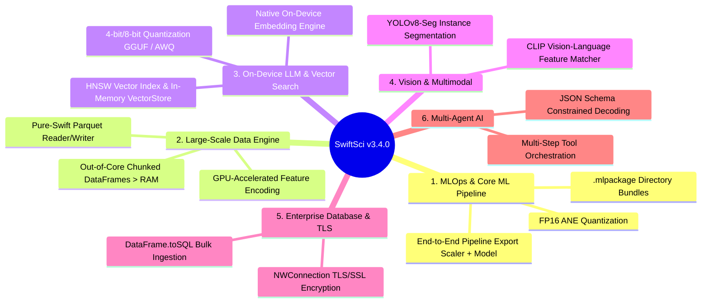

# 🗺️ SwiftSci 3.4.0 — Strategic Architectural Roadmap

> **Target Version**: `v3.3.0` – `v3.4.0`  
> **Target Release Window**: Q4 2026 / Q1 2027  
> **Platform Focus**: macOS 14+ (Apple Silicon M-Series UMA), iOS 18+, Swift 6 Strict Concurrency  

---

## 📌 Executive Vision

**SwiftSci 3.4.0** elevates the ecosystem from a complete scientific computing library into a **full-stack enterprise data science, on-device GenAI, and MLOps engine for Apple Silicon**.

The release focuses on 6 foundational pillars:
1. **End-to-End MLOps & `.mlpackage` Serialization**: Exporting complete multi-stage pipelines (`PipelineClassifier` / `PipelineRegressor`) directly to Apple Neural Engine (ANE) format with FP16 quantization.
2. **Out-of-Core & Streaming Data Processing**: Manipulating datasets exceeding physical RAM via chunked streaming DataFrames and native pure-Swift Parquet parsing.
3. **On-Device LLMs, Embeddings & Vector Search**: 4-bit/8-bit quantized execution (GGUF/AWQ) on MLX Metal, local text embedding generation, and high-performance in-memory HNSW vector indexes.
4. **Advanced Vision & Multimodal Perception**: YOLOv8-Seg instance segmentation with proto mask heads and CLIP-style image/text embedding matchers.
5. **Enterprise Database Resilience**: Apple `Network.framework` (`NWConnection`) TLS/SSL socket encryption for PostgreSQL and MySQL, plus bulk `DataFrame.toSQL` upsert routines.
6. **Multi-Agent Orchestration & Structured Decoding**: ReAct reasoning loops, multi-tool AST pipelines, and guaranteed JSON schema decoding for local LLMs.

---

## 🗺️ Architectural Mindmap

---

## 🏛️ Foundational Pillars & Technical Specifications

### 1. MLOps & Full Core ML Pipeline Serialization (`SwiftML`, `SwiftPreprocessing`)

* **End-to-End `Pipeline` Export (`PipelineClassifier` / `PipelineRegressor`)**:
  * Serialize multi-stage preprocessing pipelines (`StandardScaler` + `OneHotEncoder` + `RandomForestClassifier` or `MLPClassifier`) into a single composite Core ML container.
* **Modern `.mlpackage` Directory Bundle Support**:
  * Generate modern directory bundles with `Model.mlmodelc` and chunked weight binaries, bypassing single-file binary `.mlmodel` size limitations.
* **FP16 Weight Quantization**:
  * Add `quantizeFP16: true` option in `CoreMLExporter` to reduce memory footprint by 50% and maximize Apple Neural Engine (ANE) throughput.

---

### 2. Out-of-Core & Large-Scale Data Engine (`SwiftDataFrame`)

* **Out-of-Core Tabular Processing (`ChunkedDataFrame`, `LazyMemoryMappedCSVReader`)**:
  * Stream and filter datasets exceeding available RAM (100M+ rows) using memory-mapped chunk buffers.
* **Pure-Swift Apache Parquet Reader/Writer**:
  * Direct zero-copy column chunk parsing with Snappy and Zstandard decompression without external C libraries.
* **MLX Metal GPU-Accelerated Feature Encoding**:
  * Parallelize `OneHotEncoder` and categorical token lookup across GPU compute pipelines for millions of records.

---

### 3. On-Device LLMs, Embeddings & Vector Search (`SwiftLLM`, `SwiftCluster`, `SwiftNLP`)

* **In-Memory HNSW Vector Index & VectorStore (`SwiftCluster`)**:
  * Implement Hierarchical Navigable Small World (HNSW) graph indexing supporting Cosine Similarity, Dot Product, and L2 Euclidean distance.
* **On-Device Text Embedding Engine (`LocalEmbeddingModel`, `SwiftNLP`)**:
  * Local embedding generation for semantic search, deduplication, and zero-latency local RAG workflows.
* **4-bit & 8-bit Quantization Kernels (GGUF / AWQ) (`SwiftLLM`)**:
  * Native MLX Metal dequantization kernels enabling Llama-3, Qwen-2.5, and Gemma-2 models to run on 8GB/16GB Apple Silicon Macs.

---

### 4. Advanced Computer Vision & Multimodal Inference (`SwiftVision`)

* **YOLOv8-Seg Instance Segmentation**:
  * Extend `CSPDarknet` + `PANet` with a ProtoMask head and dynamic mask coefficient regression for real-time pixel-level segmentation.
* **CLIP Vision-Language Feature Matcher**:
  * Cosine similarity matching between image embeddings and text embeddings in a shared latent space on MLX Metal GPU.

---

### 5. Enterprise Database Resilience & Writeback (`SwiftDatabase`)

* **Native TLS/SSL Socket Encryption**:
  * Secure pure-Swift TLS handshakes using Apple `Network.framework` (`NWConnection`) for PostgreSQL (Amazon RDS / Google Cloud SQL) and MySQL.
* **Batch SQL Writeback (`DataFrame.toSQL`)**:
  * High-throughput bulk `INSERT` and `UPSERT` routines from in-memory `DataFrame` buffers directly into SQLite, PostgreSQL, and MySQL tables.

---

### 6. Autonomous Multi-Agent AI & Constrained Decoding (`SwiftAgent`)

* **Multi-Step Tool Orchestration**:
  * ReAct (*Reasoning + Action*) loops with multi-turn query planning, dynamic back-tracking, and error recovery.
* **JSON Schema Constrained Grammar Decoding**:
  * Token-level grammar masking ensuring local LLM generations strictly conform to Swift `Codable` schemas.

---

## ⏱️ Release Milestones & Phased Rollout

| Milestone | Target Version | Key Deliverables | Status |
| :--- | :---: | :--- | :---: |
| **Phase 1** | **`v3.3.0`** | `.mlpackage` directory export, `Pipeline` Core ML chaining, `NWConnection` TLS/SSL, `DataFrame.toSQL`. | 📋 Planned |
| **Phase 2** | **`v3.3.5`** | In-memory `VectorStore` (HNSW), `LocalEmbeddingEngine`, cosine similarity vector search. | 📋 Planned |
| **Phase 3** | **`v3.4.0`** | Out-of-Core `ChunkedDataFrame`, pure-Swift Parquet engine, YOLOv8-Seg, 4-bit quantized `SwiftLLM`. | 📋 Planned |

---

## 📐 Verification & Quality Assurance Standards

* **DocC Documentation**: Maintain **100.00% public API coverage** with `--warnings-as-errors`.
* **Strict Concurrency**: Zero data-race violations under Swift 6 strict concurrency (`Sendable` / `actor`).
* **Test Suite Expansion**: Target 450+ unit tests across all 14 modules with continuous integration on macOS Apple Silicon.
