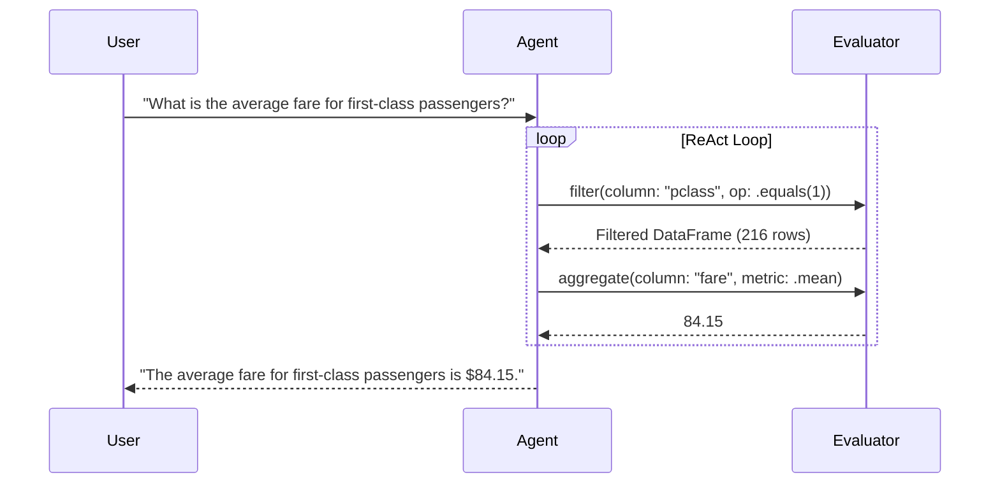

# Autonomous Data Analysis Agents with ReAct Loops

Build autonomous, sandboxed AI agents that analyze DataFrames, execute statistical aggregations, and generate natural language insights.

## Overview

`SwiftAgent` provides an agentic reasoning and execution framework tailored for analytical workloads. By combining a **ReAct (Reason + Act)** loop with a secure, sandboxed command interpreter, agents can autonomously explore datasets without risking arbitrary code execution.



## 1. Running an Autonomous Agent Query

```swift
import SwiftAgent
import SwiftDataFrame

var df = try DataFrame.fromCSV(url: URL(fileURLWithPath: "titanic.csv"))
let agent = AgentEvaluator(dataFrame: df)

// Execute structured agent commands
let resultDF = try agent.execute("filter pclass == 1 | groupby survived | mean fare")
resultDF.debugPrint()
```

## Topics

### Agent Types
- ``AgentEvaluator``
