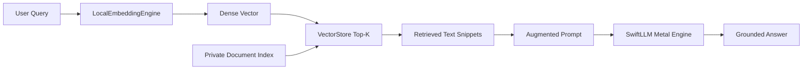

# Building On-Device RAG Pipelines

Construct privacy-preserving Retrieval-Augmented Generation workflows on Apple Silicon.

## Overview

On-Device RAG combines fast local vector retrieval with on-device language models to provide accurate, grounded answers from private local documents without cloud network dependencies.



## 1. Complete End-to-End Pipeline Example

```swift
import SwiftAgent
import SwiftCluster
import SwiftNLP
import SwiftLLM

// 1. Initialize local embedding engine and vector store
let embedEngine = LocalEmbeddingEngine(dimension: 128)
let vectorStore = VectorStore(metric: .cosineSimilarity)

// 2. Ingest private knowledge base
let corpus = [
    "SwiftSci uses Apple Accelerate vDSP for SIMD arithmetic.",
    "MLX provides unified memory GPU tensor computation on Mac.",
    "WiredMemoryManager prevents out-of-memory errors on shared RAM."
]

for (id, text) in corpus.enumerated() {
    let vec = embedEngine.embed(text)
    vectorStore.add(id: "doc_\(id)", vector: vec, metadata: ["content": text])
}

// 3. Retrieve relevant context for user question
let userQuestion = "How does SwiftSci accelerate vector math?"
let queryVector = embedEngine.embed(userQuestion)
let topMatches = vectorStore.search(query: queryVector, topK: 1)

let contextSnippet = topMatches.first?.metadata["content"] ?? ""

// 4. Assemble augmented prompt and query local LLM
let augmentedPrompt = """
Context: \(contextSnippet)
Question: \(userQuestion)
Answer:
"""
```

## Topics

### Agent Components
- ``SwiftAgentEvaluator``
