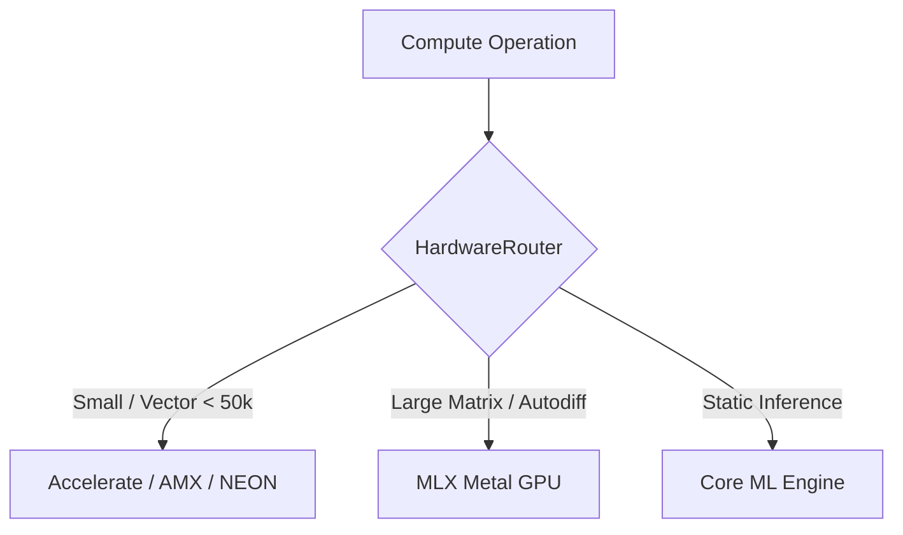

# Hardware Routing & Unified Memory Governance

Understand how SwiftSci automatically routes workloads between CPU (Accelerate/AMX/NEON) and Metal GPU (MLX) with strict concurrency safety.

## Overview

Apple Silicon features a **Unified Memory Architecture (UMA)** where the CPU, GPU, and Apple Neural Engine (ANE) share a single high-bandwidth memory pool. `SwiftPreprocessing` provides intelligent hardware routing and memory reservation primitives to prevent GPU saturation and avoid data copying.

## 1. The Hardware Router

The `HardwareRouter` assesses tensor dimensions and operation complexity to select the optimal computing engine:



* **Small Vectors (`N < 50,000`)**: Routed to CPU Accelerate (vDSP/BLAS/LAPACK) to eliminate GPU kernel dispatch latency.
* **Large Tensors & Deep Learning**: Routed to MLX Metal GPU for massive parallel throughput.

## 2. WiredMemoryManager & Ticket System

To prevent out-of-memory (OOM) conditions during concurrent analytical workloads, `WiredMemoryManager` implements an asynchronous FIFO reservation system:

```swift
import SwiftPreprocessing

// Acquire a GPU execution slot
let ticket = try await WiredMemoryManager.shared.reserveMemory(estimatedBytes: 64 * 1024 * 1024)

// Execute heavy MLX operations
// ...

// Automatically flushes GPU caches upon completion
await ticket.release()
```

## Topics

### Memory & Routing APIs
- ``HardwareRouter``
- ``WiredMemoryManager``
- ``WiredMemoryTicket``
